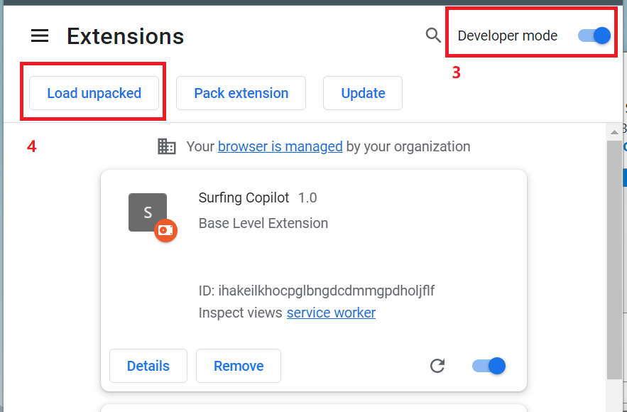

# MMD.SurfingCopilot

## Quick Setup

1. Clone the project to your computer

```
git clone https://github.com/barryzhan2017/MMD.SurfingCopilot.git
```

2. Go to the Extensions page by entering `chrome://extensions` in a new tab. (By design chrome:// URLs are not linkable.)

3. Enable Developer Mode by clicking the toggle switch next to Developer mode

4. Click the Load unpacked button and select the extension directory.



## Reference

- Extension Official Doc: https://developer.chrome.com/docs/extensions/mv3/
- API Reference: https://developer.chrome.com/docs/extensions/reference/
